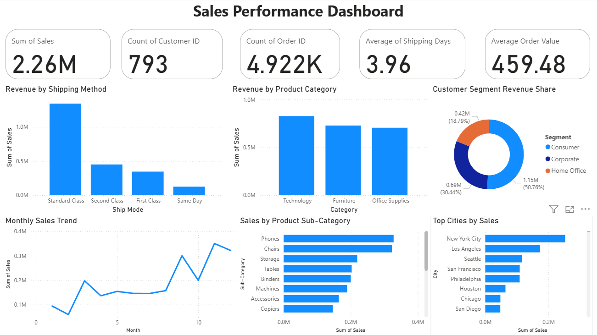

# Sales Performance Dashboard — Power BI Project

## Overview

This project presents an interactive Power BI dashboard designed to analyze sales performance across shipping methods, product categories, customer segments, monthly trends, product sub-categories, and cities.

The goal of this project is to monitor key sales metrics and generate business insights that can support sales performance analysis and data-driven decision-making.

## Dashboard Preview

## Dataset

The dataset is a Superstore-style sales dataset containing order, customer, product, shipping, location, and sales information.

Main fields include:

- Order ID
- Order Date
- Ship Date
- Ship Mode
- Customer ID
- Customer Name
- Segment
- Country
- City
- State
- Region
- Category
- Sub-Category
- Product Name
- Sales

## Tools Used

- Power BI
- Power Query
- DAX
- Excel

## Key Metrics

- Total Sales: 2.26M
- Total Customers: 793
- Total Orders: 4.92K
- Average Shipping Days: 3.96
- Average Order Value: 459.48

## Dashboard Features

- KPI cards for total sales, customers, orders, average shipping days, and average order value
- Revenue by shipping method
- Revenue by product category
- Customer segment revenue share
- Monthly sales trend
- Sales by product sub-category
- Top cities by sales

## Dashboard Insights

### Sales Overview

The dashboard provides a high-level overview of sales performance. Total sales reached 2.26M, with 793 customers and 4.92K orders. The average order value was 459.48, and the average shipping time was 3.96 days.

### Revenue by Shipping Method

Standard Class generated the highest revenue among all shipping methods. This indicates that most sales are associated with standard shipping, while Same Day shipping contributed the lowest revenue.

### Revenue by Product Category

Technology was the top-performing product category by revenue, followed by Furniture and Office Supplies. This suggests that Technology products are the strongest revenue driver in the dataset.

### Customer Segment Revenue Share

The Consumer segment contributed the largest share of revenue, accounting for around 50.76% of total sales. Corporate customers represented about 30.44%, while Home Office customers contributed around 18.79%.

### Monthly Sales Trend

Monthly sales showed fluctuations throughout the year, with stronger performance in the later months. Sales increased noticeably around months 8, 11, and 12, indicating stronger revenue periods toward the end of the year.

### Sales by Product Sub-Category

Phones and Chairs were the top-performing sub-categories by sales. These sub-categories appear to be key contributors to overall revenue and may be important focus areas for sales strategy.

### Top Cities by Sales

New York City generated the highest sales among all cities, followed by Los Angeles and Seattle. This shows that sales are concentrated in major urban markets.

## Business Recommendations

- Focus sales and marketing efforts on the Consumer segment, as it contributes the largest share of revenue.
- Prioritize Technology products, especially high-performing sub-categories such as Phones.
- Investigate opportunities to increase sales in lower-performing shipping methods such as Same Day delivery.
- Strengthen marketing campaigns in top-performing cities such as New York City, Los Angeles, and Seattle.
- Analyze late-year sales growth to identify seasonal patterns and plan future promotional campaigns.

## Project Files

- `README.md`: Project documentation, including overview, metrics, insights, and recommendations.
- `Sales_Performance_Dashboard.pbix`: Main Power BI dashboard file.
- `dashboard-preview.png`: Preview image of the final dashboard.
- `data/train.csv`: Dataset used for the dashboard, if included.
